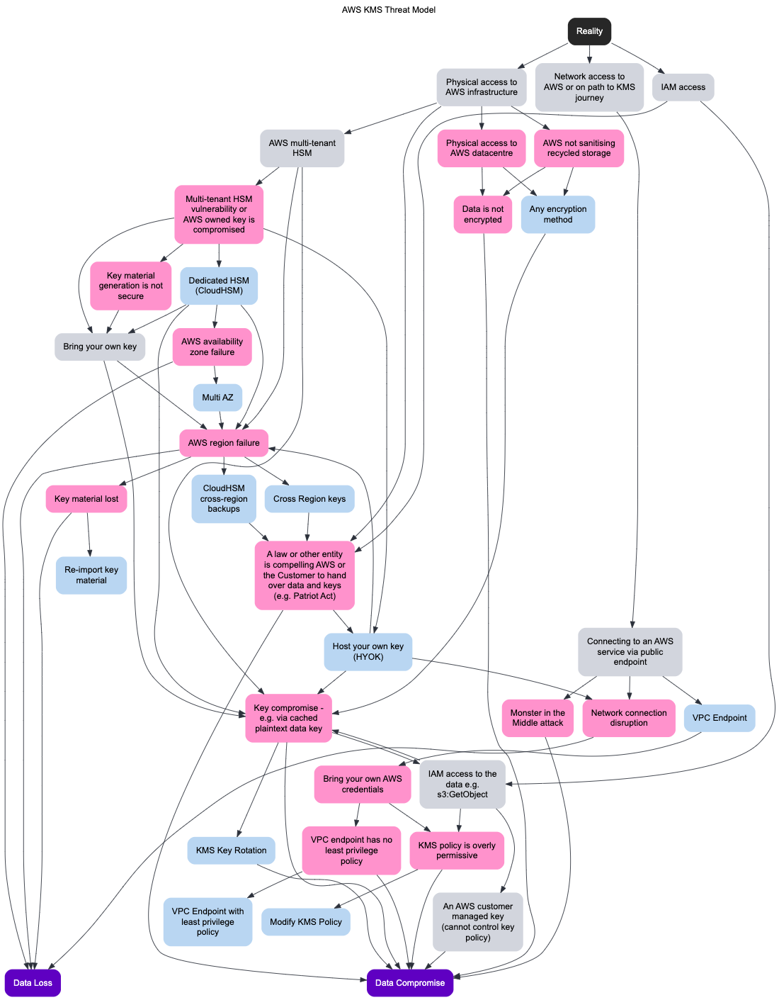

For the attack trees:

I've used https://www.deciduous.app/ for the attack trees.
Open the website and paste the contents of `attack_tree.yaml` on the left hand side column

For the threat models:
Use https://draw.io
